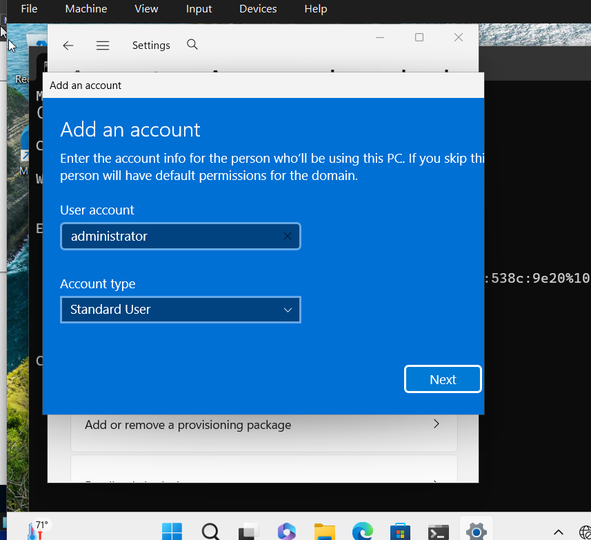
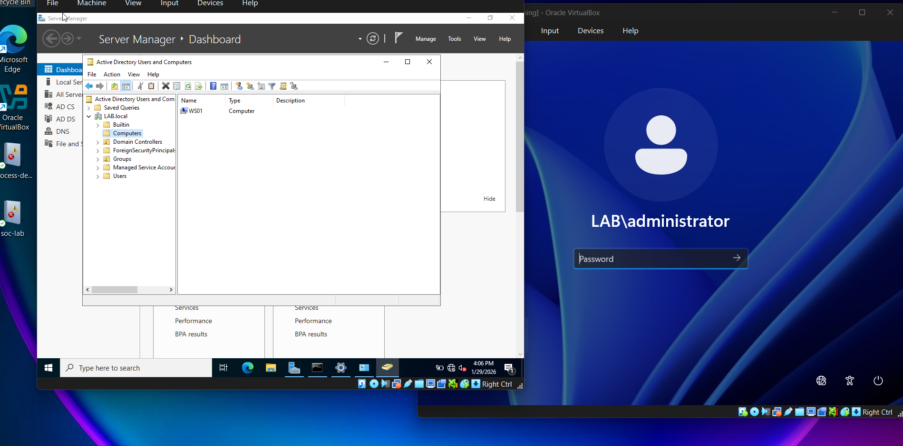

# Attaching Windows 11 VM to Domain

This section demonstrates how to configure a Windows 11 virtual machine and join it to the Active Directory domain

---

### Step 1: Create a NAT network in VirtualBox
1.  Open **Oracle VM VirtualBox Manager**
2. Navigate to: 
    
    File -> Tools -> Network Manager 

3. Select **NAT networks**
4. Click **create**

    Example name: ADNetwork
5. Click **Apply**

---

### Step 2: Configure VM Network Adapters 
********
** *NOTE* **  
Due to running 2 VMs at the same time 

Drop memory for Windows 11 VM **IF** host machine has the following : 

 ~16 GB or 8 GB 

**********

**Windows 11 VM**
1. open **setting** for the Windows 11 VM
2. Navigate to **Network** Section
3.  Set Adapter 1 to: NAT Network 
4. Select the network you created: ADNetwork
5. Click **OK**

**Windows Server VM**
Repeat the same steps for the Windows Server VM so both machines are connected to the same virual network.

---

### Step 3: Start Both Virtual Machines

Start:
- Domain Controller (Server VM)
- Windows 11 Workstation VM

Login to the **Server VM** first. 

### Step 4: Configure a Static IP address on the Server 
   
Active Directory environments require the Domain Controller to use a static IP address.

**Check Current IP Address**
1. Open **Command Prompt**
2. Run: ipconfig

---
 **Configure Static Address**

1. Open **Network & Internet Settings**
2. Click **Change Adapter Options**
3. Right-click **Ethernet -> Properties**
4. Double-click: **Internet Protocol Version 4 (IPv4)** 
5. Select: **Use the following IP address**

Configure the values: 
- *IP Address*: Use the current IPv4 shown in ipconfig

- *Subnet Mask*: 255.255.255.0

- *Default Gateway*: Same gateway shown in ipconfig 

- Preferred DNS Server: Set to the **Domain Controller's IP address**

6. Click **OK**

---

### verfiy configuration
run the command again: 

ipconfig 

---

### Step 5: Configure the Windows 11 Workstation

Switch to the Windows 11 VM. 

Login to Windows

---
### Rename the Computer 

1. Open **Search bar** in the taskboard (bottom screen)
2. Type  **View My PC Name**
3. Rename the computer

    Example server name:

    WS01

    **WS** = Workstation 
    
    **01** = First Workstation in environment

4. Click **Restart Now**

---

### Step 6: Configure Workstation Static IP 
After restarting: 

1. Open **Command Prompt**
2. Run: ipconfig 

---
### Configure IPv4 Settings
1. Search: View network connections 
2. Righ-click **Ethernet-> Properties**
3. Double-click: **Internet Protocol Version 4 (IPv4)**
4. Select: **Use the following IP address**

Configure: 
- *IP address:* Sequential address within the network 
- *Subnet mask:* 255.255.255.0
- *Default gateway:* same gateway as the server
- *Preferred DNS Server:* Domain Controller IP address

5. Click **OK**

---

### Step 7: Join the Workstation to the Domain

1. Open **Search bar** in the taskboard (bottom screen)
2. Search: **Access work or school**
3. Click connect
4. Select: **Join this device to a local Active Directory Domain**
5. Enter the domain name

    Example: 
    LAB.local

6. Click **Next**

---

## Authentication with Domain Administrator 

Enter credentials for **Domain Administrator account**

Click **OK**

Contiue through the prompts and select: 

**Restart Now**

---

### Step 8: Login Using a Domain User

After restarting:
1. Select **Other User** on the login screen
2. Login using one of the **domain users created earlier**

---

### Step 9: Verify the Workstation in Active Directory 

On the **Server VM**:
1. Open **Server Manager**
2. Navigate to: **Tools -> Active Directory Users and Computers**
3. Select: **Computers**

The workstation should appear in the list: 

Example: 

