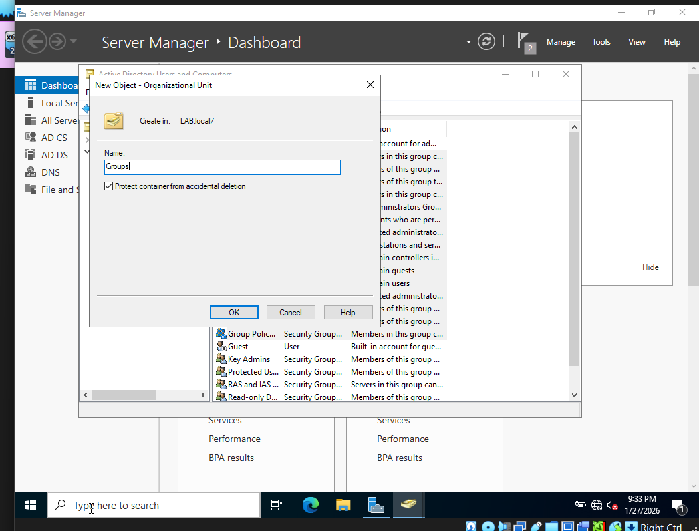
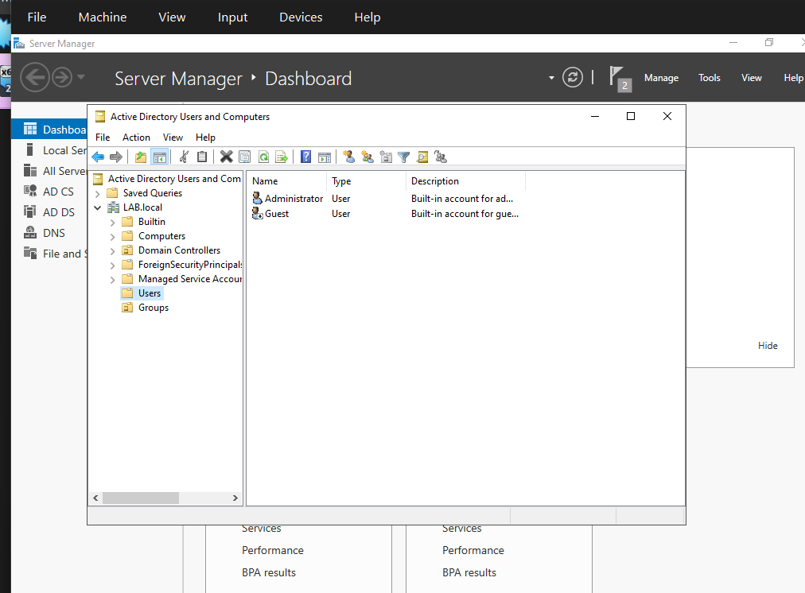
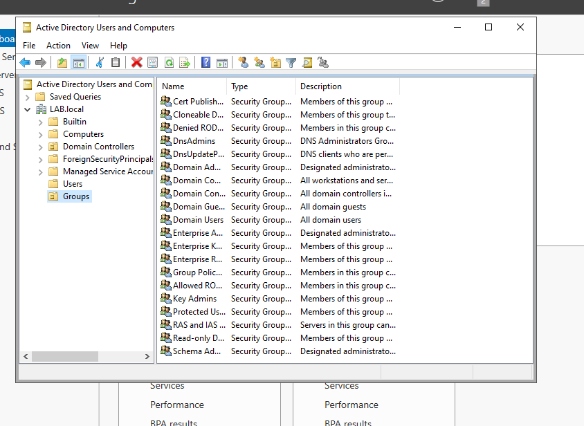
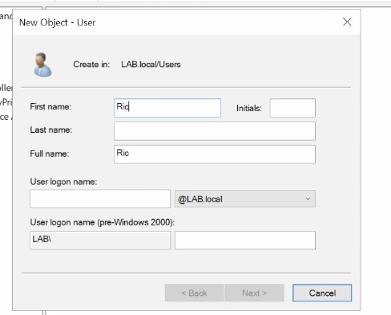
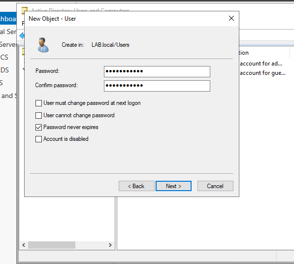
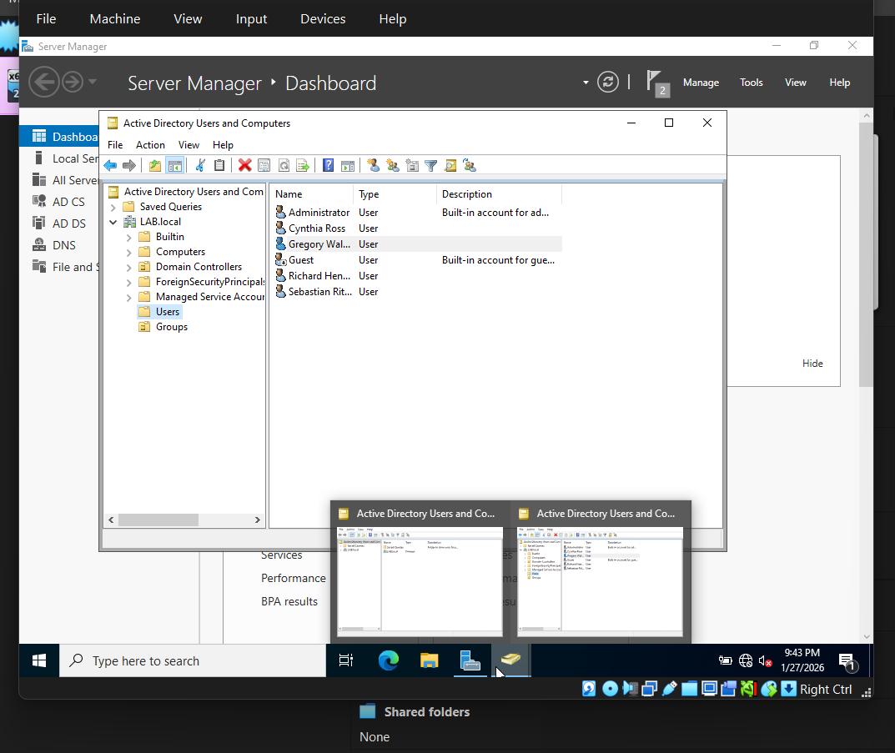

# Creating Domain Users

This section demonstrates how to create Organizational Units (OUs) (further detail will be in a different document) and Domain users within Active Directory. Organizaing users into OUs helps keep the directory structured and simplifies management. 

---
### Step 1: Open Active Drectory Users and Computers
1. Open **Server Manager**
2. Navigate to: **Tools -> Active Directory Users and Computers**

This tool is used to manage users, groups and organizational units within the domain.

---

### Step 2: Create an Organizational Unit 

Organizational Units help organize users and groups inside a Active Directory 
1. Right-click the Users folder or the domain
2. Select: **New -> Organization Unit** 

3. Name the OU (for example: Groups)

### Step 3: Move Users into the Organizational Unit

Once the OU has been created:
1. Select multiple users by holding shift
- Leave Administrator and Guest user unhighlighted
2. Drag the selected users into the Groups OU.

After moving users, the **Users** folder should look similar to the following:

The **Groups** OU should now contain the moved users:

This organization makes it easier to manage users within the domain. 

---

### Step 4: Create a New Domain User

1. Right-click in white space 
2. Select: **New -> User**

3. Enter the following information: 
- First Name 
- Last Name 
- User logon name

For this lab, the naming convention used was: 

FirstInitalLastName

Example: 
rhendricks 

---

### Step 5: Configure the User Password 

Set a password for the user account 

For this lab environment: 
- **Password never expires** was enabled.

**In a real production environment**, this setting is not recommended because it weakens security policies. 

## Step 6: Repeat for Additional Users

Repeat the process to create additional domain users. 

For this lab, four users were created to simulate a small organizational environment.

