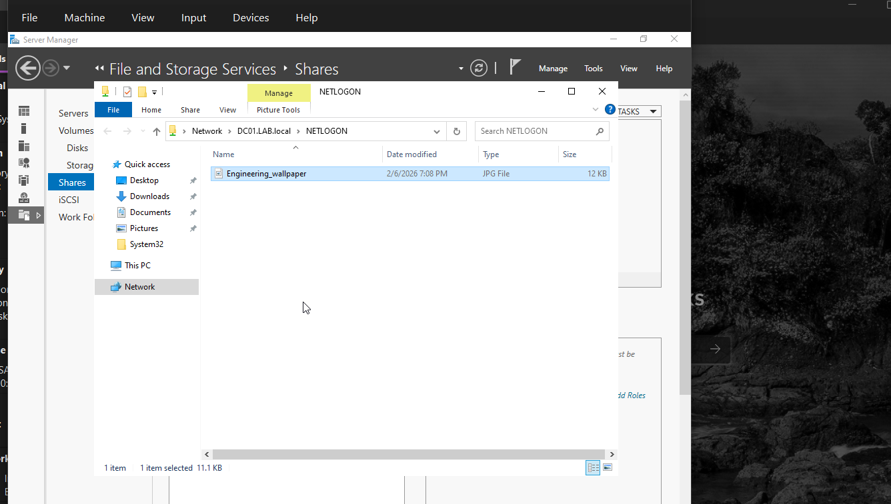
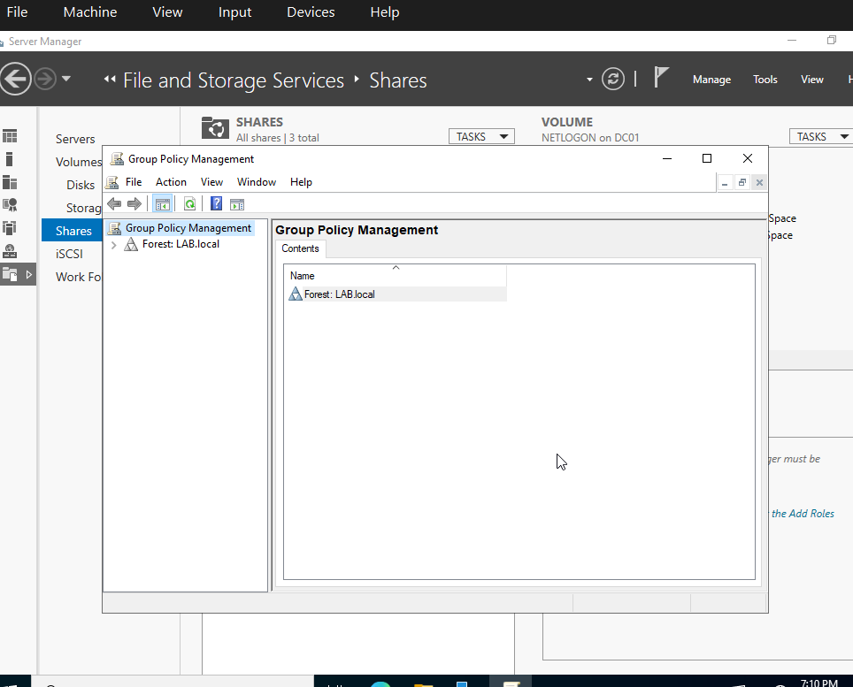
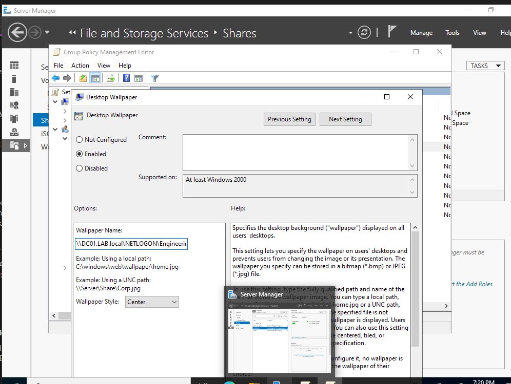
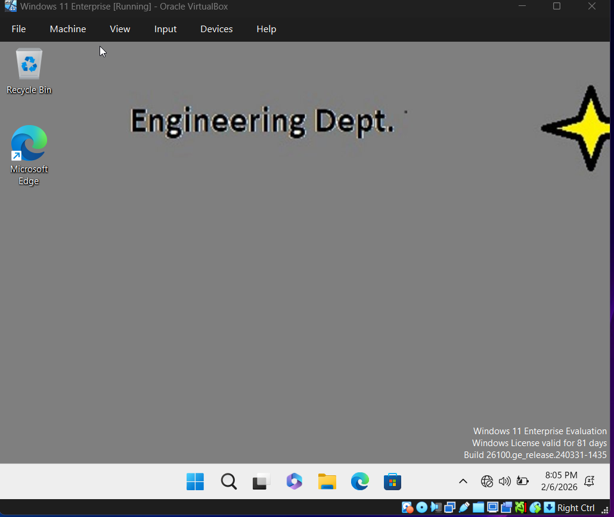
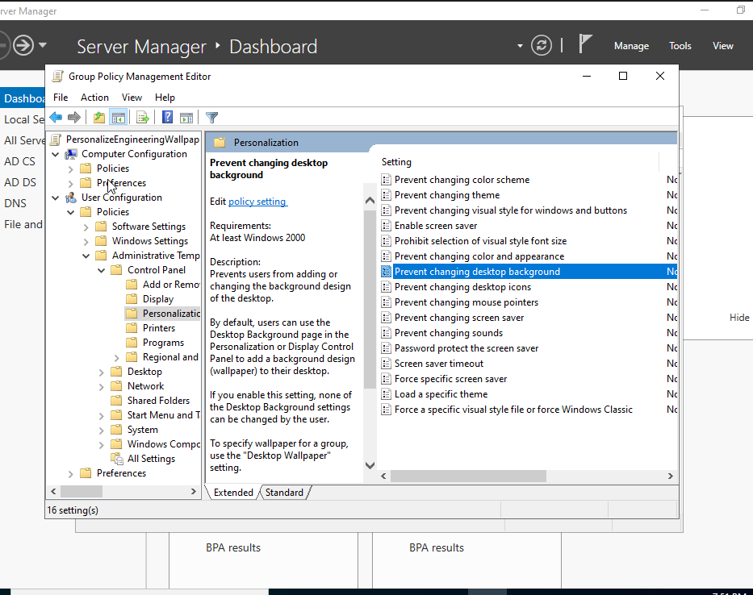

# Group Policy Objects

This section demonstrates how to configure a Group Policy Object (GPO) to enforce a specific desktop background for users in the Engineering Organizational Unit (OU)

---

### Step 1: Grab JPEG or Create image

A custom image will be used as the desktop background. 
1. Create or downlaod an image. 
2. Ensure the size is 1920 x 1080 as it is standard desktop. 
3. Save as: ***Engineering_wallpaper.jpeg**

----

### Step 2: Store the image in NETLOGON Share

The wallpaper must be accessible to accessible to the users in the Engineering department. The shared folder created previously can be used, but we will be using NETLOGON. 

1. Open **Server Manager**
2. Navigate to: **File and Storage Services -> Shares**
3. Right-click: **NETLOGON -> Open Share**
4. Copy the wallpaper image into the NETLOGON folder
- To copy the file path: 
    - Hold **Shift + Right-click** on the image
    - Select **Copy as Path**

** *NOTE* **

This path will be used in the Group Policy

---

### Step 3: Create and Link a  Group Policy Object (GPO)
1. Navigate to: **Tools -> Group Policy Management**

2. Expand: 
    Forest: LAB.local
    Domain: LAB.local

3. Right-click **Engineering** folder
4. Select **Create a GPO in this domain, and link it here**
6. Enter name: **SetEngineeringBackground**
7. Click **OK**

---

### Step 4: Configure the Desktop Wallpaper Policy
1.  Right-click the newly created GPO: 
2. Select **Edit**
3. Navigate to: 

    User Configuration
    
    -> Policies
    
    -> Administrative Templates
    
    -> Desktop
4. Click **Desktop**
5. double-click on: **Desktop Wallpaper**
6. Configure the policy: 
    Set to: **Enabled**
    Paste the copied image path into the **Wallpaper Name**

16. Click **Apply**, then **OK**

---
### Step 5: Verify the Policy

1. Switch to windows 11 VM
2. Log in as a user from **Engineering department**

The desktop background should now display the configured wallpaper. 

---
### Verify Policy Scope 

To confirm the policy is applied only for the intended users: 

- Log in as a non-Engineering user

The default Windows wallpaper should remain unchanged.

---

### Step 6: (optional)Prevent Users from Changing the Wallpaper

To enforce stricker control, you can prevent users from modifying the desktop background.

---
### create a lock policy
1. Navigate to: **Tools -> Group Policy Management**
2. Navigate to **Engineering OU**
4. Right-click **Engineering** folder
5. Select **Create a GPO in this domain, and link it here**
6. Name the policy:  **LockDesktop**
7. Click **OK**

---
### configure the policy 

1. Right-click on the new GPO -> **Edit**
2. Navigate to:
    
    User Configuration

    -> Policies

    -> Administrative Templates

    -> Control Panel
3. Click **Personalization**
4. Select: **Prevent changing desktop background**
5. Set the policy to: **Enabled**
6. Click **Apply**, then **OK**

