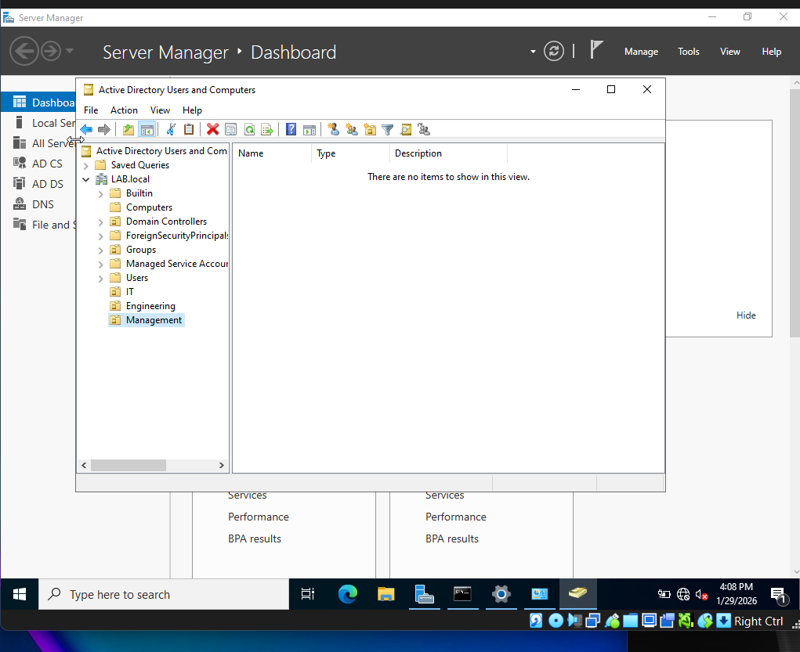
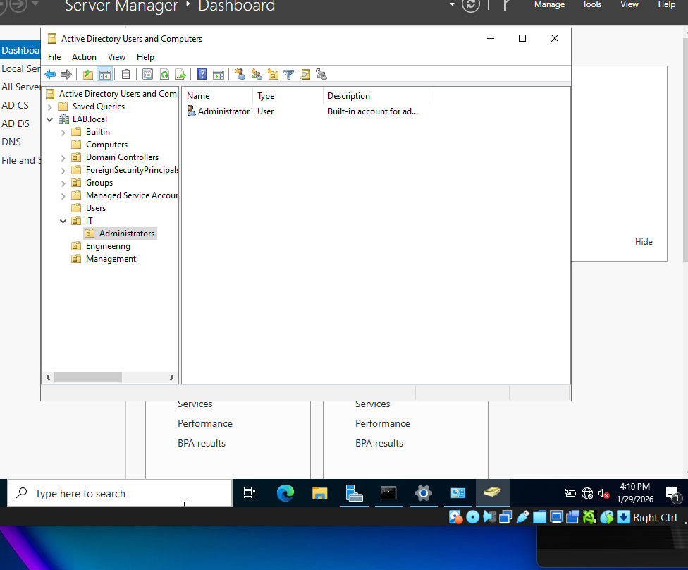
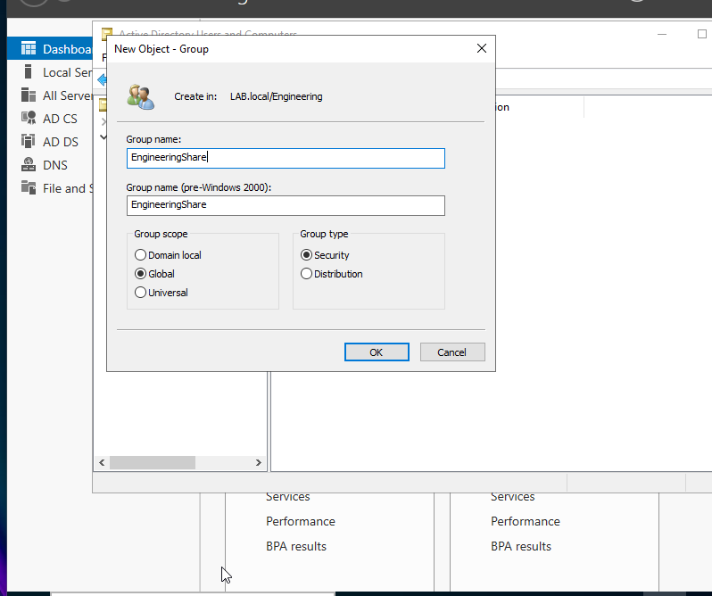
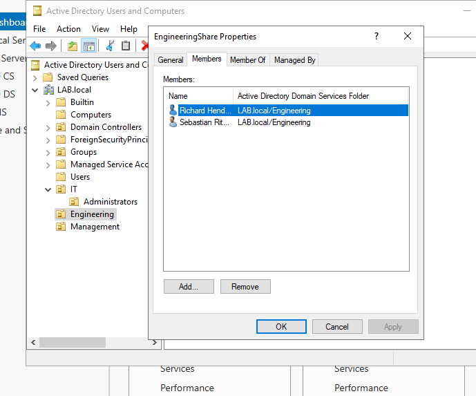
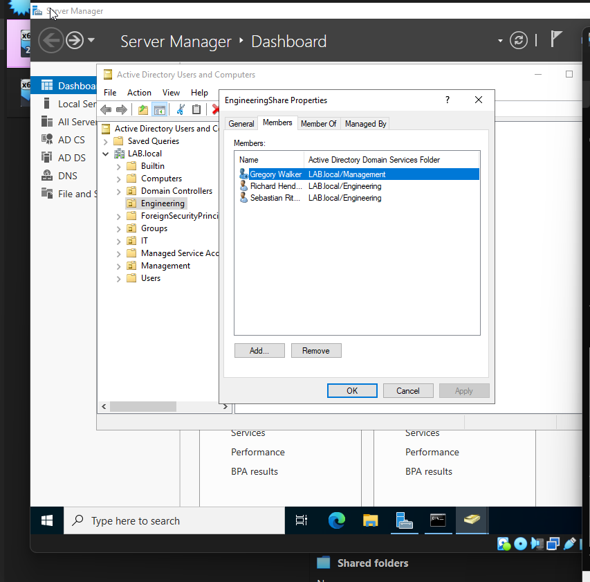
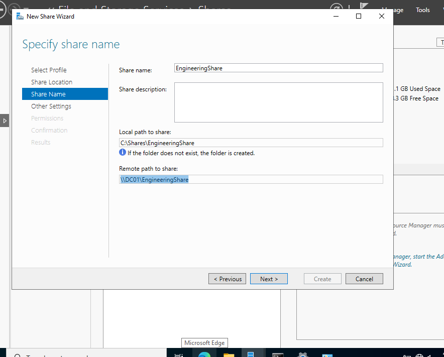
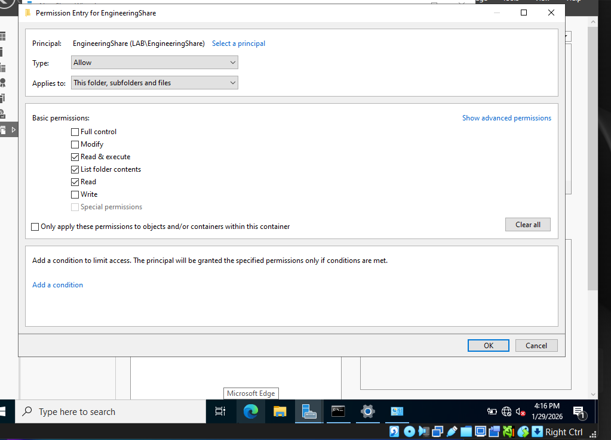
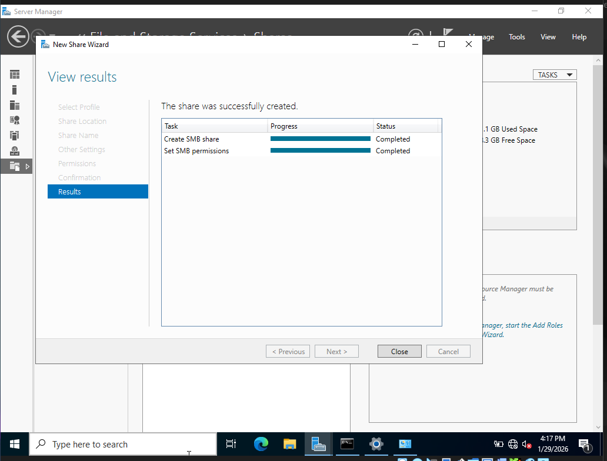
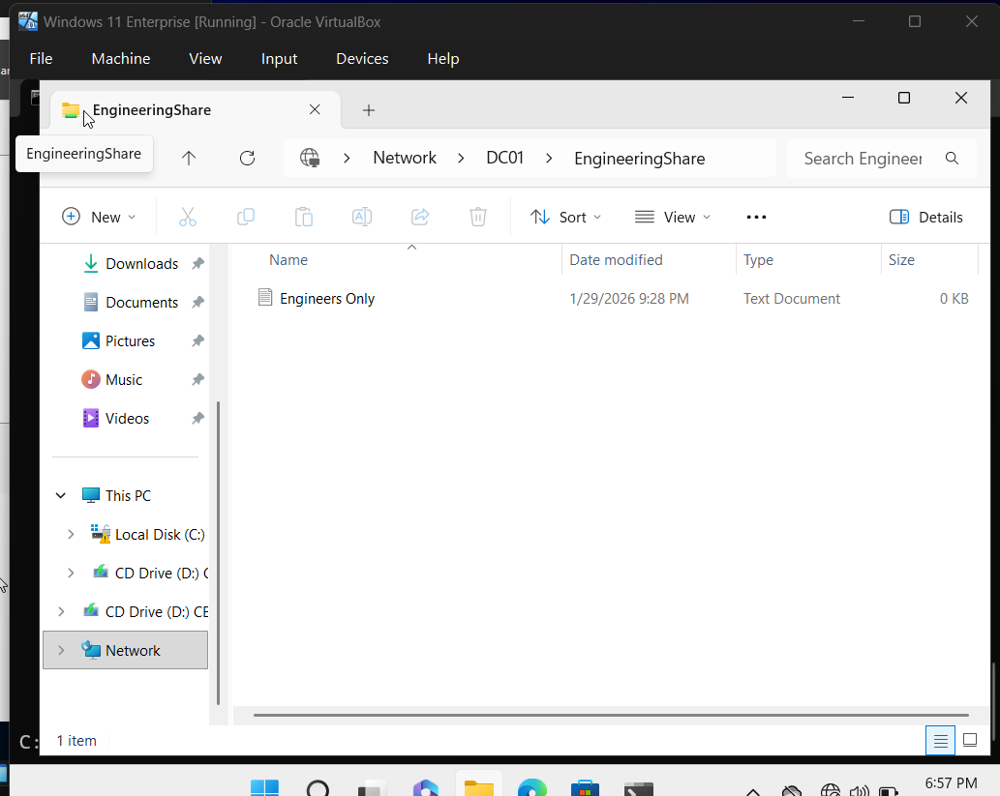
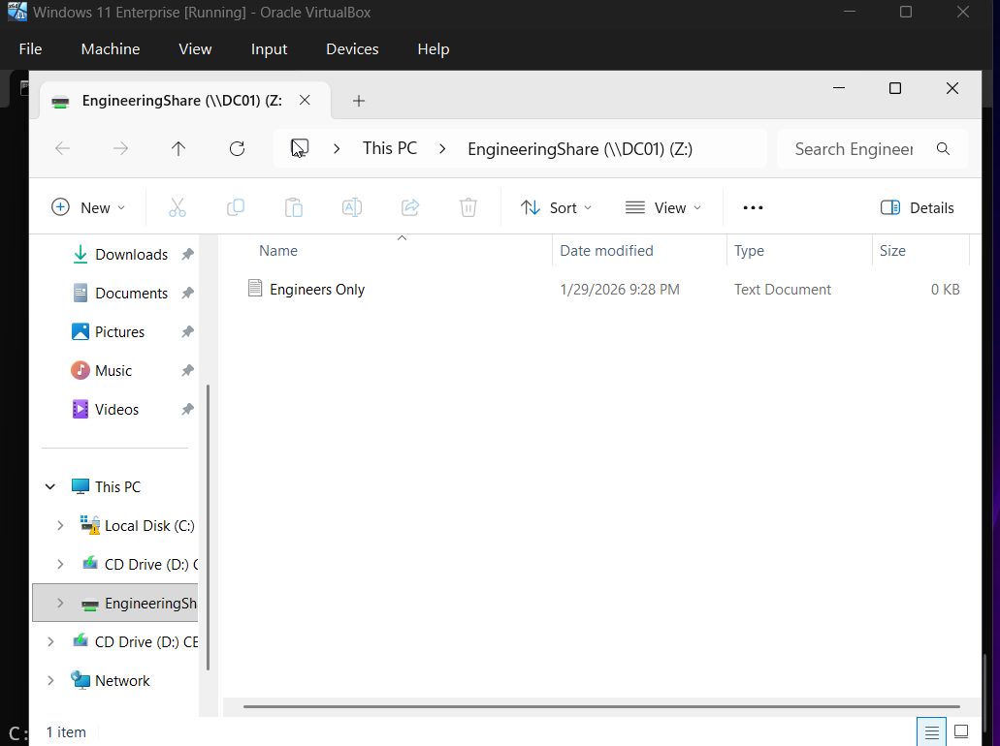

# Organizational Units, Groups and Shared Folder Permissions

This section demonstrates how to organize users using Organizational Units (OUs), create security groups, and configure shared folder permissions in Active Directory. 

---

### Step 1: Open Active Directory Users and Computers

1. Open **Server Manager**
2. Navigate to: **Tools -> Active directory users and computers**
3. Expand the domain 

Example: LAB.local

---

### Step 2: Create Organizational Units for Department

Organizational Units help organize users and simplify administration. 

1. Right-click the **domain name**
2. Select: **New -> Organizational units**
3. Create the following OUs:
- Engineering
- Management 
- IT 

Your directory should look similar to the following:
 

---

### Step 3: Move Users into Organiztional Units 

Users can now be organized by department 

Example: 
- Move the administrator account into the **IT OU**

---

### Step 4: Create a Sub-Organizational Unit

Sub-OUs allow for more **granular administrative control**

1. Navigate to the **IT OU**
2. Right-click inside the folder
3. Select: **New -> Organizational Units**
4. Nmae the OU: Administrators
5. Move the **Administrator account** into this OU

Example structure:

---

# Setting Permissions

### Step 5: Create a Security Group

security groups are used to assign permissions to resources

1. navigate to the **Engineering OU**
2. Right-click inside the folder
3. Select: **New -> Group**
4. Enter the group name: EngineeringShare

Keep the default options:
- *Group Scope*: Global
- *Group Type*: Security

Click **OK**

---

### Step 6: Add Users to the Security Group 
1. Double-click the **EngineeringShare** group
2. Navigate to the **Members** tab
3. Click **Add**

Add users from the Engineering department. 

** *NOTE* **
Click **Check Names** to validate the account names before clicking add.

----

### Add additional user

In this scenario, a **Management user** is also given access because they are acting as a project manager. 

Example membership list before management:

click **Apply** and **OK**

Example membership list with management:

---

### Step 7: Creating a Shared Folder

Shared folders allow domain users to access files on the server. 
1. Open **Server Manager**
2. Navigate to: **Files and Storage Services -> Shares**
3. Select: **Tasks -> New Share**
4. Choose: **SMB Share - Quick**
5. Select the **server location** and keep the default volume.
6. Enter the share name: **EngineeringShare**

Proceed with default setting until the **Permissions** section

** *NOTE* ***
REMEMBER the remote path to share, we will need it later. 

---

### Step 8: Configure Folder Permissions
To restrict access to specific users:
1. Click **Disable Inheritance**
2. Select: **Convert inherited permissions into explicit permissions**
3. Remove the following permissions;
- Users - Read & Execute 
- Users - Special 

This prevents **all users** from accessing the folder.

---
### Add Engineering Security Group 

1. Click **Add**
2. Select **Principal**
3. Enter the group name: **EngineeringShare**
4. Assign **Write** Permissions

Click **OK**, then continue through the wizard

---

### Step 9: Confirm Share Creation
Once the share is created, the results section should appear as:

Click **Close**

---

### Step 10: Test Access from Windows 11
Login to the Windows 11 workstation using an **Engineering department user**.

1. open **File Explorer**
2. Enter the **shared folder path (remote path)**
Example: 
\\DC01\Engineering

The shared folder should now appear in File Explorer

If the folder does not appear, see the troubleshooting guide:

[Troubleshooting: Shared Folder Not Visible](../troubleshooting/shared-folder-not-visible.md)

---

## Optional: Test File Creation

Inside the shared folder; 
1. Right-click
2. Select: **New -> Text Document**
3. Create a test file

Example: Engineering Only

---

### Step 11: mapping network shares 

Mapping the drive allows for easier access:
1. Right-click **This PC**
2. Select: **Map Network Drive**
3. Choose a drive letter
4. Enter the network path (remote path)

Example: 
\\DC01\EngineeringShare

5. Click **Finish**

should look like the following:

---

### Step 12: Test Access Restrictions 
Log out and sign in with a **user outside the Engineering department**

Attempt to access the shared folder using the path: 

Example: \\DC01\EngineeringShare

The user should receive a message stating that **Windows cannot access the folder**, confirming the permissions are correctly configured 