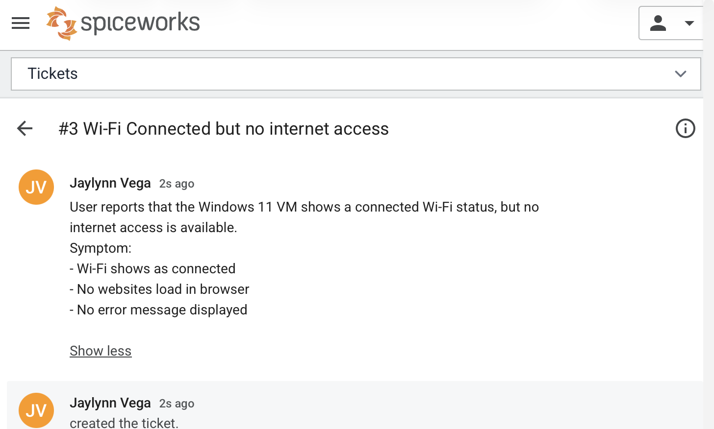
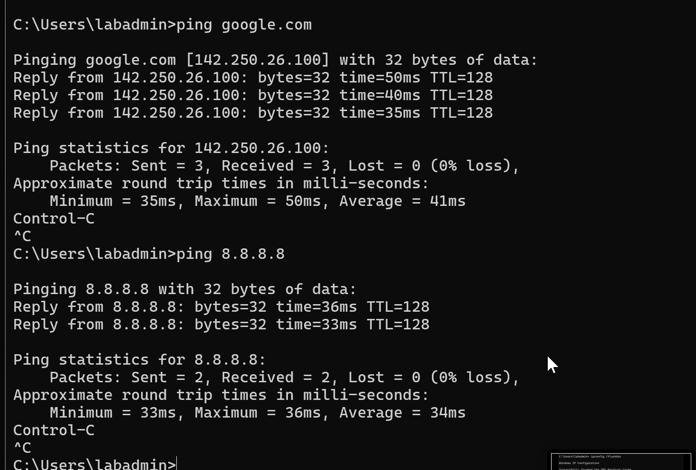
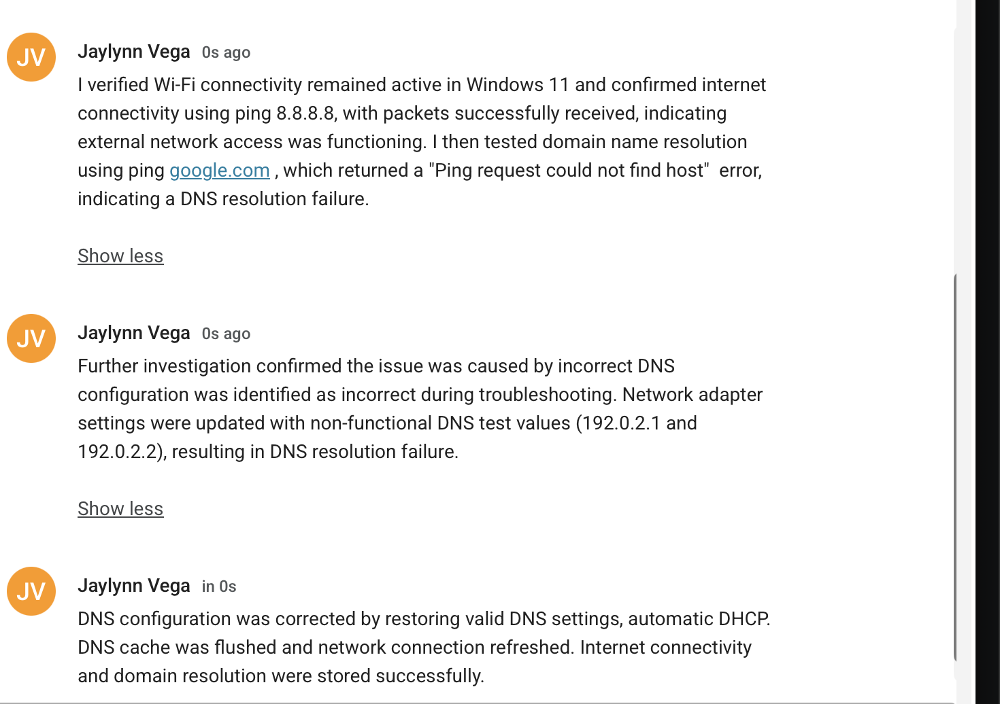

# Ticket #001 - Wi-Fi Connectivity Issue Ticket

---

## Summary

User reports that Windows 11 VM shows a connected Wi-Fi status; however, there is no internet access. Websites fail to load despite an active network connection.

---

## Symptoms
- Wi-Fi shows connected status 
- No websites load in browser
- Error message of cant reach page for www.office.com

---

## Affect User
- Operating System: Windows 11 VM
- User: Windows 11 User 

---

## Investigation 
- Opened web browser and attempted to access multiple websites (failed to load)
- Verifed network connectivity status (Wi-Fi shows connected)
- Opened Command Prompt and ran DNS connectivity test: 
    ping google.com
    Output was "Ping request could not find host google.com. Please check the name and try again."
    
This indicates a DNS resolution failure
- Further testing confirmed basic network connectivity was still functional.

---

## Root Cause 

The issue was caused by incorrect DNS configuration on the network adapter. The system was assigned non-functional/static DNS values instead of valid DNS servers, resulting in failure to resolve domain names.

---

## Resolution
- Opened network adapter settings 
- Set IPv4 properties to "Obtain an IP address automatically"
- Flushed DNS cache using ipconfig /flushdns 
- Renew network configuration to ensure updated setting were applied using ipconfig /release and ipconfig /renew
- Retested connectivity successfully.

## Evidence

Ticket in Spicework

Ping output before fix 

Ping output after fix

Browser after fix 

Completed and closed ticket

---

## Verification 

- ping google.com successful
- ping 8.8.8.8 successful 
- websites load normally in browser 
- DNS resolution functioning correctly

---

## Tools used 
- Command Prompt 
- Network Adapter Settings 
- DNS configuration settings 
- ping 
- ipconfig /flushdns 
- ipconfig /release 
- ipconfig /renew

---

## Lessons Learned

DNS misconfiguration can result in full loss of internet access even when network connectivity appears active. Verifying name resolution is a critical step in network troubleshooting. 
