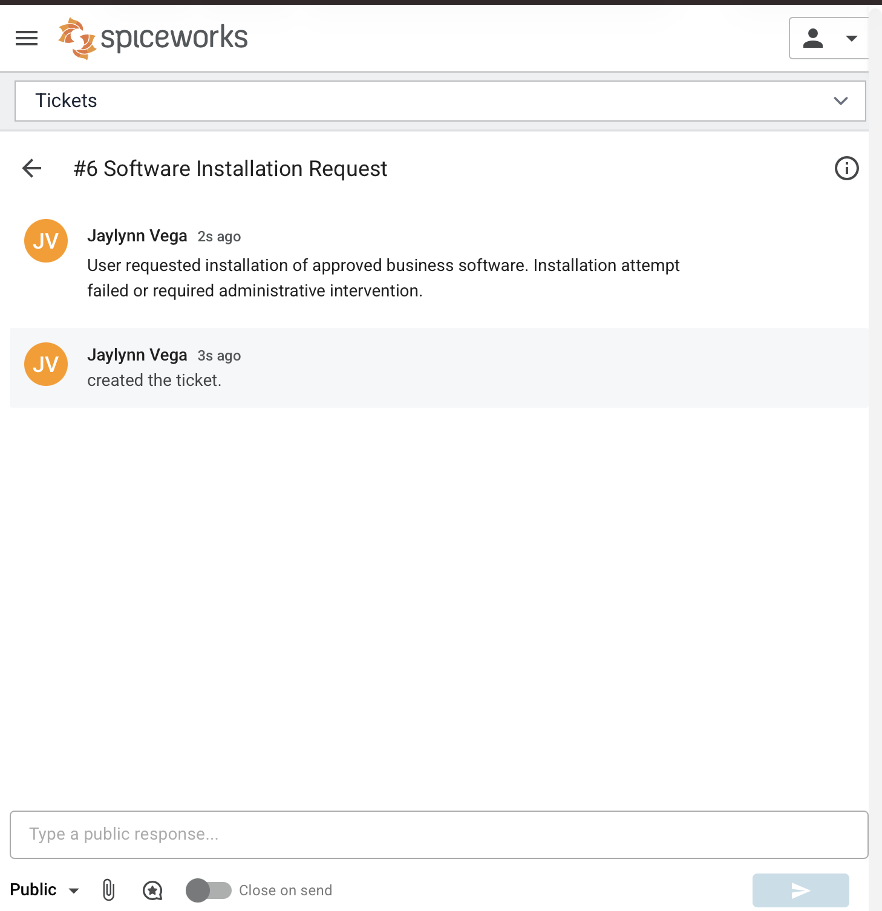
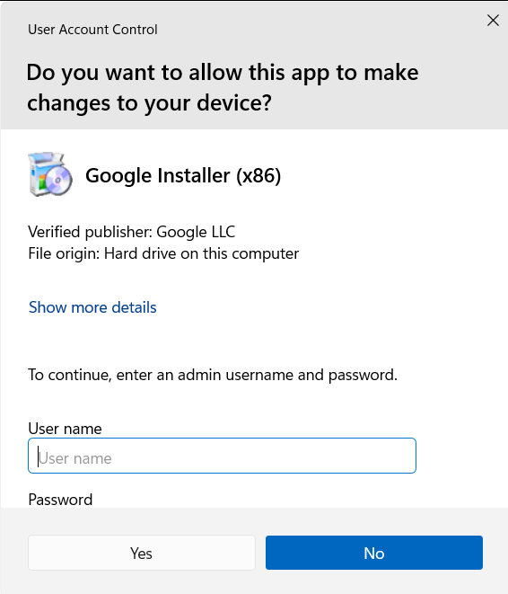
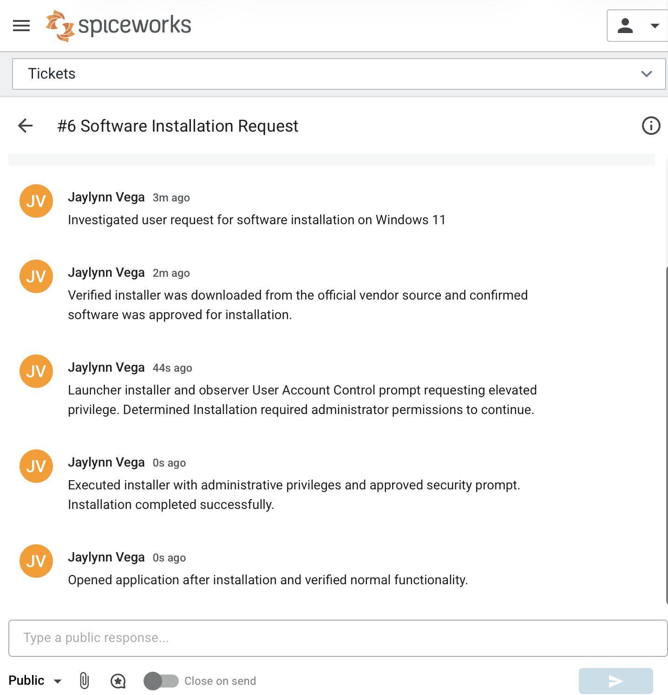

# Ticket #004 Software Installation Issue

---

## Summary

User reported Windows 11 VM showing missing security updates. Multiple updates were pending installation, and one cumulative security update became delayed during installation progress. 

---

## Symptoms
- User unable to complete installation independently 
- Installer prompted for administrator approval
- Application not installed initially

---

## Affect User
- Operating System: Windows 11 VM
- User: Windows 11 User 

---

## Investigation 
- Veried request for approved software installation
- Confirmed installer downloaded from official vendor source
- Launched installer and observer User Account Control (UAC) prompt requesting elevated privileges
- Determined standard user permissions were insufficient for installation.

---

## Root Cause 

Software installation requires administrative privileges to write system files and complete application setup.

---

## Resolution
- Executed installer using administrative privileges
- Approved UAC prompt/ entered administrator credentials
- Completed installation successfully
- Verified application launched normally
## Evidence

Ticket in Spicework

UAC prompt 

App Open

Completed and closed ticket

---

## Verification 
- Software installed successfully 
- Application opens normally 
- User able to use requested software

---

## Tools used 
- Web browser
- Software installer
- User Account Control
- Windows Application Management

---

## Lessons Learned

Many software installations require elevated privileges. Verifying legitimacy of software and understanding UAC prompts are key Help Desk responsibilities.
