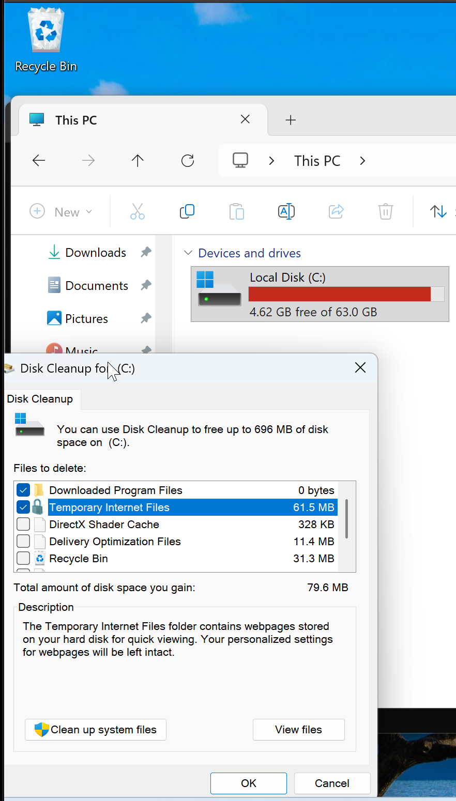
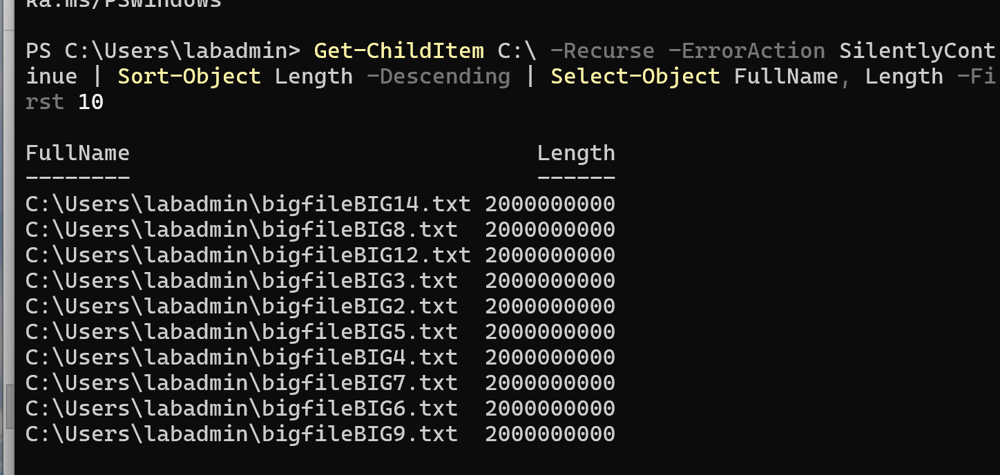
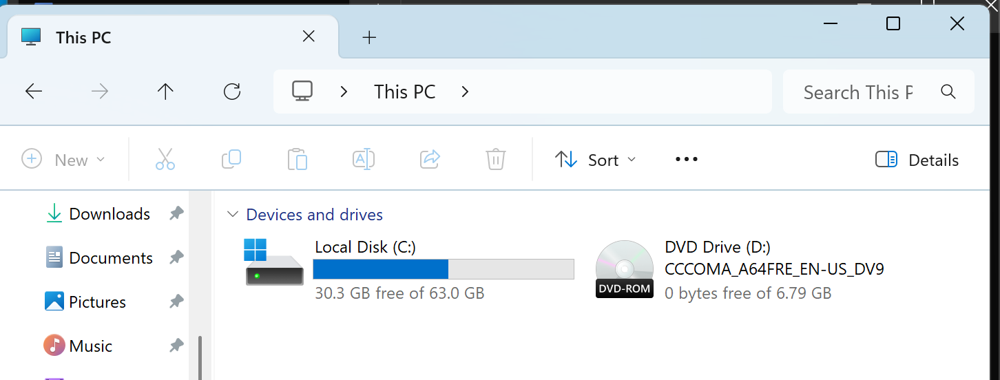
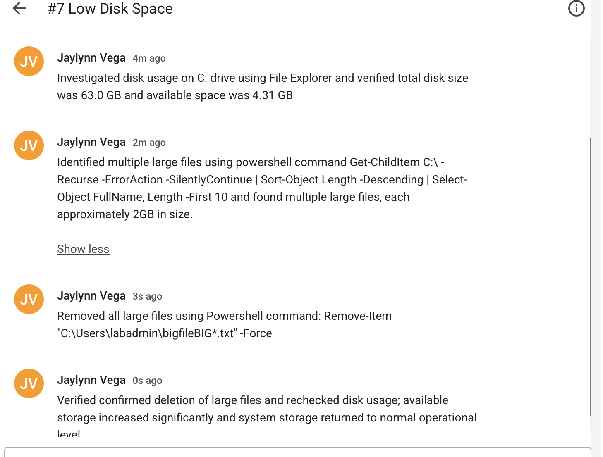

# Ticket #005 - Disk Space Cleanup

---

## Summary
User reported low disk space on Windows 11 VM causing reduced system performance and limiting normal system operations.

---

## Symptoms
- Low disk space on C: drive (approximately 4.31 GB free out of 63.0 GB)
- Potential system performane degradation
- Limited ability to install or update applications

---

## Affect User
- Operating System: Windows 11 VM
- User: Windows 11 User 

---

## Investigation 
- Opened File explorer and verified disk usage on C:drive 
- Confirmed total disk size of 63.0GB with only 4.31 GB available 
- Identified disk space was critically low 
- Attempted inital cleanup using Disk Cleanup utility: 
    - Ran cleanmgr
    - Selected C:drive 
    - Chose temporary files, recycle bin, and thumbnails for deletion
    - Executed cleanup
- Determined additional disk space was still required after inital cleanup
- Used Powershell to locate large files:
    Get-ChildItem C:\ -Recurse -ErrorAction SilentlyContinue | Sort-Object Length -Descending | Select-Object FullName, Length -First 10
- Results showed multiple large files, each approximately 2 GB in size, contributing to disk space consumption. 

---

## Root Cause 
Excessive disk usage caused by multiple large files that were not removed through standard disk cleanup methods.

---

## Resolution
- Removed large unnecessary files using PowerShell:
    Remove-Item "C:\Users\labadmin\bigfileBIG*.txt" -Force
- Freed significant disk space on the system 
- Restored normal storage levels 

---

## Evidence
- C: drive showing low disk space (before cleanup) and Disk cleanup tool screen

- PowerShell output listing large files 

- PowerShell deletion command 

- C: drive after cleanup (increased free space)
 

- Spiceworks completed ticket

---

## Verification 
- Rechecked disk usage after cleanup
- Confirmed available storage increased significantly
- System storage returned to normal operational levels 
- No low disk space warning present

---

## Tools used 
- File Explorer
- Disk Cleanup Utility (cleanmgr)
- PowerShell

---

## Lessons Learned

Standard tools like Disk Cleanup can remove temporary files, but may not address large user-generated files. PowerShell is an effective tool for identifying and removing large files when deeper cleanup is required.
