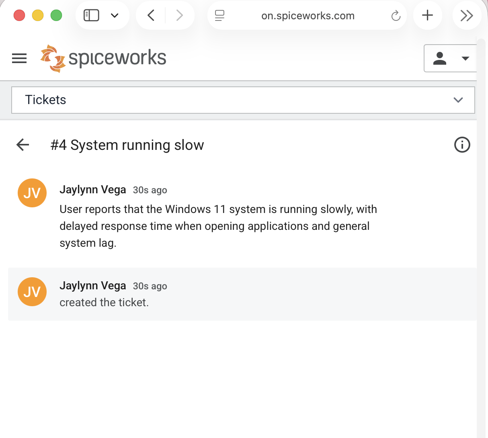
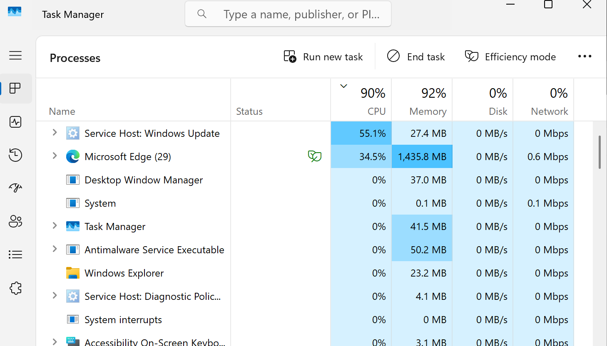
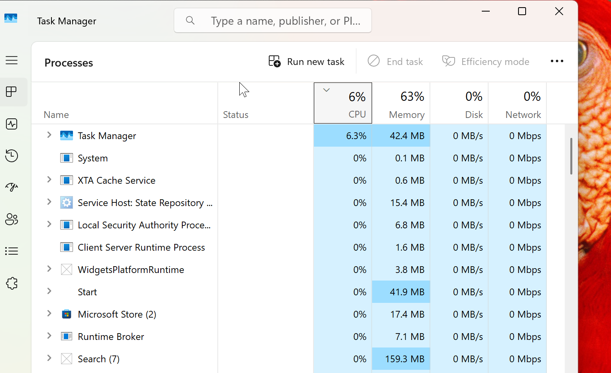
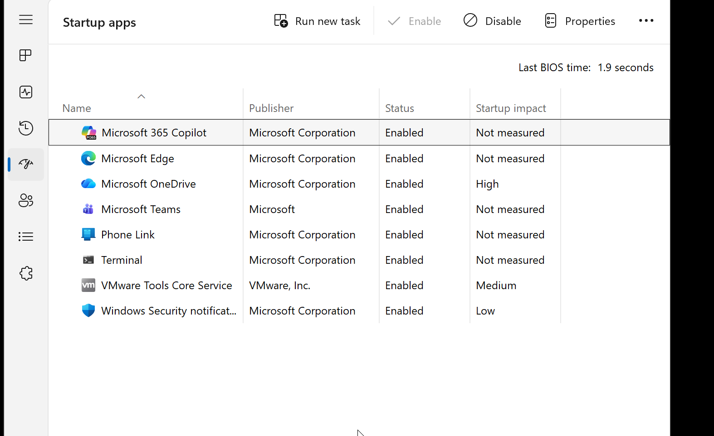
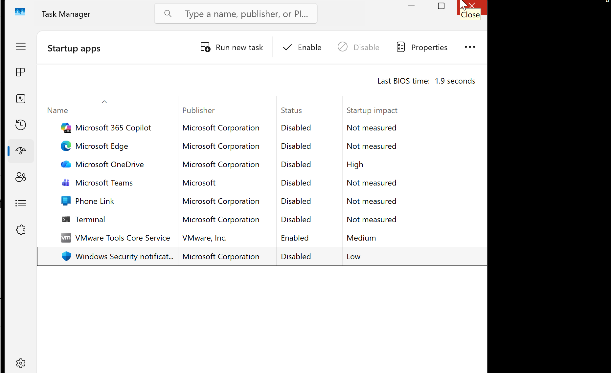

<<<<<<< HEAD
# Ticket #002 - Slow PC Performance

---

## Summary

User reports that Windows 11 VM is experiencing significant performance degradation, including slow response times, lag when opening applications, and overall system sluggishness.

---

## Symptoms
- System responsiveness is slow
- Applications take longer than usual to open
- Noticeable lag when switching between programs
- CPU usage observed at 100%
- Memory usage elevated to ~78%
---

## Affect User
- Operating System: Windows 11 VM
- User: Windows 11 User 

---

## Investigation 
- Opened Task Manager using ctrl + shift + esc to analyze system performance
- Observed CPU utilization at 100%, indicating excessive processing load
- Identified multiple active applications and browser tabs consuming high CPU and memory resources
- Reviewed Startup tab in Task Manager and noted several enabled startup applications contributing to background resource usage.

---

## Root Cause 

The issue was caused by excessive CPU and memory utilization due to multiple active applications, browser tabs, and unnecessary startup programs running simultaneously.

---

## Resolution
- Terminated high CPU and memory-consuming processes using Task Manager
- Closed unnecessary applications and browser tabs
- Disabled non-essential startup applications via Task Manager's Startup tab 
- Reduced overall system resource usage
- Restarted system to ensure changes were fully applied

## Evidence

Ticket in Spicework

Task manager before

Task manager after

Startup tab before

Startup tab after

Completed and closed ticket

---

## Verification 

- CPU usage reduced to normal levels
- Memory usage decreased
- System responsiveness improved
- Applications open and run without noticeable delay

---

## Tools used 
- Task Manager 
- Startup Applications Manager
- System Monitoring (CPU / Memory Usage)

---

## Lessons Learned

High CPU and memory usage from multiple applications and startup processes can significantly degrade system performance. Task Manager is an essential tool for identifying resource bottlenecks and resolving performance-related issues efficiently.
=======
# Ticket #002 - Slow PC Performance

---

## Summary

User reports that Windows 11 VM is experiencing significant performance degradation, including slow response times, lag when opening applications, and overall system sluggishness.

---

## Symptoms
- System responsiveness is slow
- Applications take longer than usual to open
- Noticeable lag when switching between programs
- CPU usage observed at 100%
- Memory usage elevated to ~78%
---

## Affect User
- Operating System: Windows 11 VM
- User: Windows 11 User 

---

## Investigation 
- Opened Task Manager using ctrl + shift + esc to analyze system performance
- Observed CPU utilization at 100%, indicating excessive processing load
- Identified multiple active applications and browser tabs consuming high CPU and memory resources
- Reviewed Startup tab in Task Manager and noted several enabled startup applications contributing to background resource usage.

---

## Root Cause 

The issue was caused by excessive CPU and memory utilization due to multiple active applications, browser tabs, and unnecessary startup programs running simultaneously.

---

## Resolution
- Terminated high CPU and memory-consuming processes using Task Manager
- Closed unnecessary applications and browser tabs
- Disabled non-essential startup applications via Task Manager's Startup tab 
- Reduced overall system resource usage
- Restarted system to ensure changes were fully applied

## Evidence

Ticket in Spicework

Task manager before

Task manager after

Startup tab before

Startup tab after

Completed and closed ticket

---

## Verification 

- CPU usage reduced to normal levels
- Memory usage decreased
- System responsiveness improved
- Applications open and run without noticeable delay

---

## Tools used 
- Task Manager 
- Startup Applications Manager
- System Monitoring (CPU / Memory Usage)

---

## Lessons Learned

High CPU and memory usage from multiple applications and startup processes can significantly degrade system performance. Task Manager is an essential tool for identifying resource bottlenecks and resolving performance-related issues efficiently.
>>>>>>> 047dedc9931062932bce437497fe21db2fbd13ae
