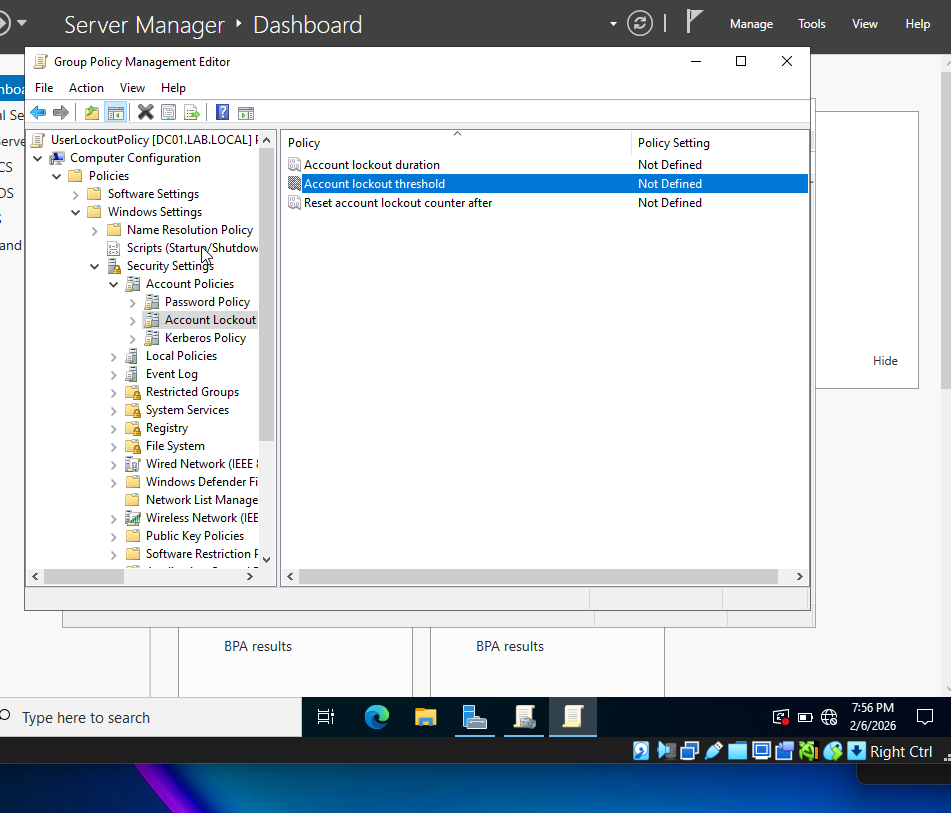
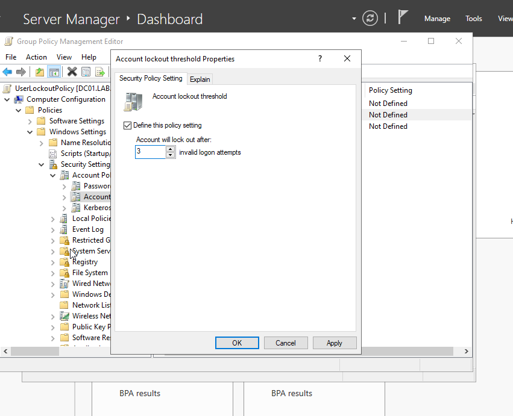
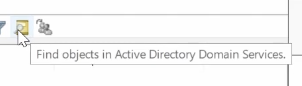
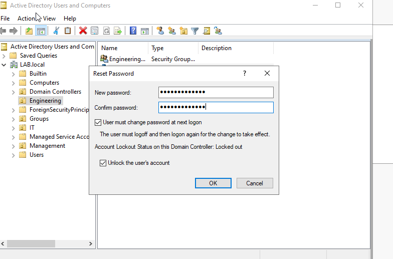
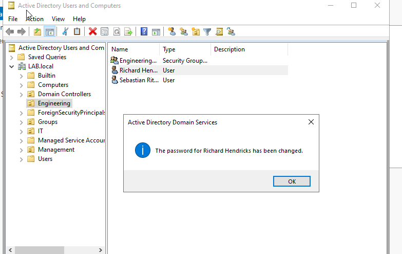
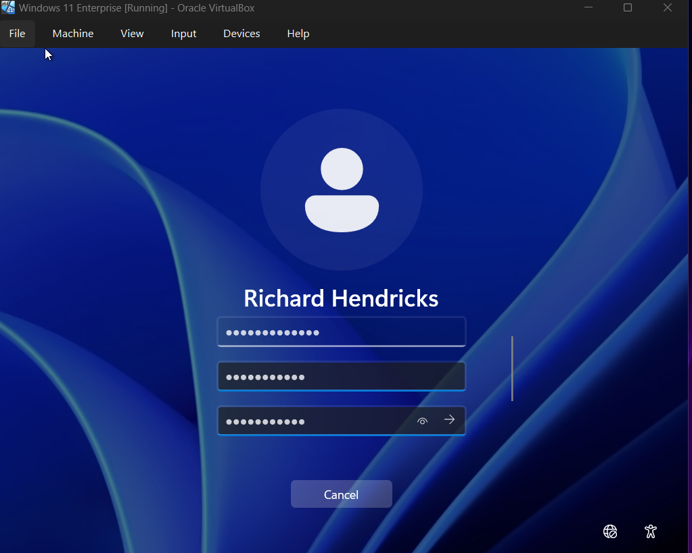
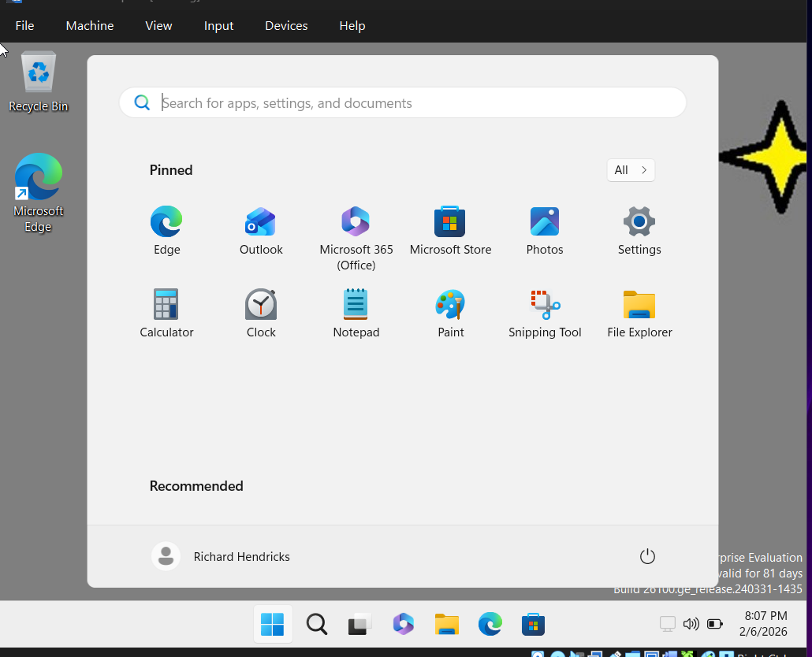

# Account Lockout Policy & Password Reset

This section demonstrates how to configure an Account Lockout Policy, simulate failed login attemtps, and reset a locked-out user account in Active Directory. 

---

### Step 1: Configure Account Lockout Policy (GPO)

1.  Open **Server Manager**
2. Navigate to: **Tools -> Group Policy Management**
3. Right-click the domain: LAB.local
4. Click **Create a GPO in this domain, and Link it here...**
5. Name the policy: **AccountLockoutPolicy**
6. Click **OK**

---

### Step 2: Configure Lockout Settings 

1. Right-click the newly created GPO -> **Edit**
2. Navigate to: 
    Computer Configuration
    
    -> Policies

    -> Windows Settings 

    -> Security Settings
    
    ->  Click **Account Policies**

3. Double-click: **Account Lockout Policy**
4. Double-click: **Account Lockout threshold Policy**

    
5. Configure the policy:
    - Check **Define this policy setting**
    - **3** invalid logon attempts  
 

This means the account will be locked after 3 failed login attempts. 

6. Click **Apply**, then **OK**
7. Accept any suggested changes in the pop-up window. 

--- 

### Enforce the Policy 

1. Return to **Group Policy Management**
2. Right-click the GPO
3. Click **Enforce**

---

### Step 3:  Simulate Failed Login Attempts

1. Switch to **Windows 11 VM**
2. Attempt to login using a domain user account (non-admin)
3. Enter an incorrect password **3 times**

After the third attempt, you should see:

"The referenced account is currently locked out and may not be logged on to"

Click **OK**

---

### Step 4: Reset the Locked Account Password
Switch back to the **Windows Server VM.**

1. Open **Server Manager**
2. Navigate to: **Tools -> Active Directory Users and Computers**
3. Locate the user: 
    - Browse manually 
    - Or use **Find** to search the entire directory
    
4. Right-click on user account-> click **Reset Password**
5. Enter a new password
6. Select the following options: 
    - **User must change password at next logon**
    - **Unlock the user's account**

7. Click **OK**

---

### Step 5: Verify Password Reset

Switch back to **Windows 11 VM**

1.Log in using the updated password

After entering the password, you should see: 

"The user's password must be changed before signing in"

2. Click **OK**
3. Enter a new password
4. Click **OK**

You should now successfully logged in.

