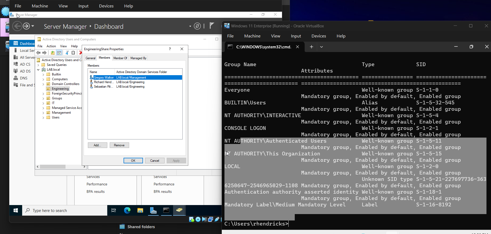
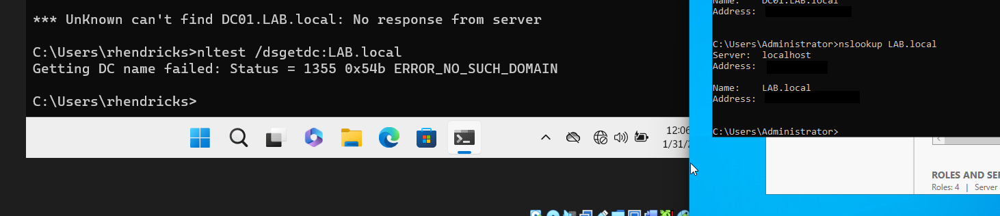
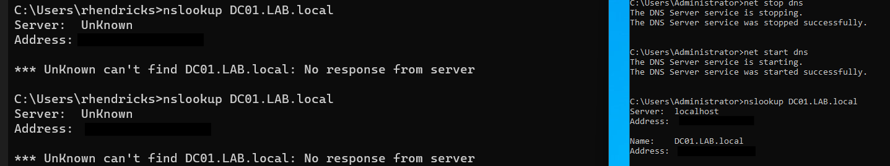
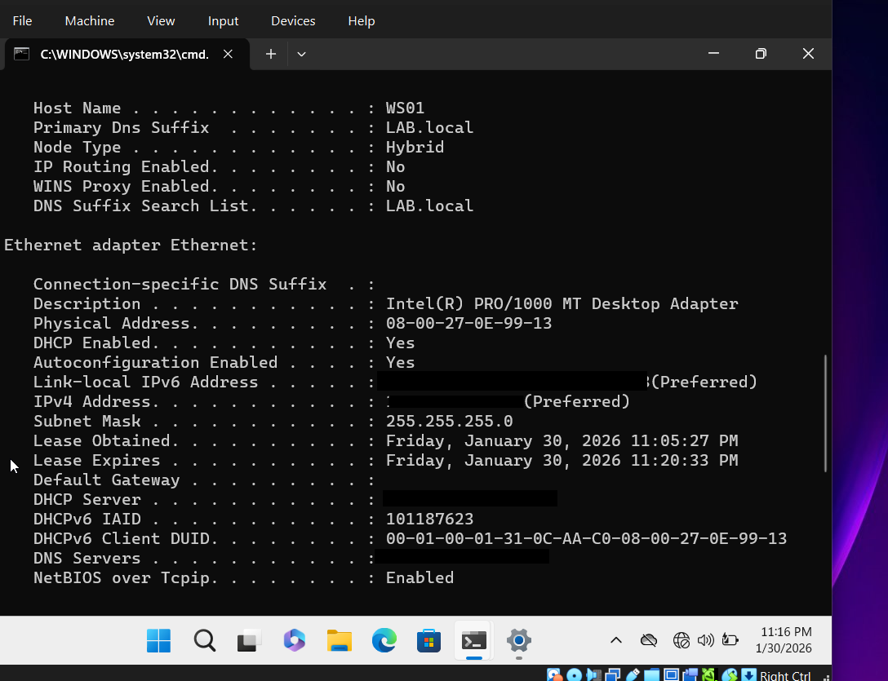
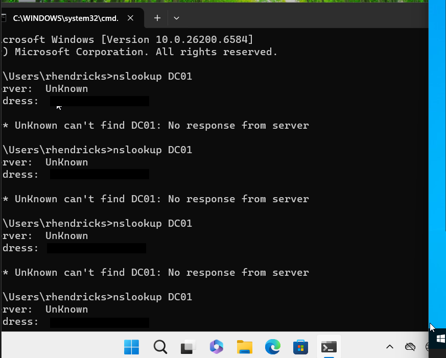

## Shared Folder not Visible 

**Issue**
Engineering domain users were unable to **access or view the shared folder** from the Windwos 11 client. 

---

### Initial Assumptions
The following configurations were verified: 
- The user was added to the correct **security group**
- The shared folder was assigned to that group 
- Permissions appeared correctly configured on the server

---

### Troubleshooting steps: 

1. **Verify User Context**
Confirm the currently logged-in user: 
    whoami

2. **Verify group membership**
Check if the user belongs to the correct security group: 
    whoami /groups 

3. **Test Direct Network Access**
    Attempt to access the share folder directly. 
        \\DC01\EngineeringShare

4. **Test Domain Connectivity** 
    Verify the client can locate the Domain Controller 
        nltest /dsgetdc:LAB.local 

    **RESULT**  
        ERROR_NO_SUCH_DOMAIN

    This indicates the client could **NOT** locate the Domain Controller. 

5. **Test Name Resolution**
    Ping the Domain Controller: 

     
    ping DC01
     
     

    **RESULT**
        Host not found 

6. Test DNS Resolution 
    Query DNS directly: 
        nslookup DC01
    
    **RESULT** 
        - No response from server
        - DNS server reachable but not resolving queries correctly

7. **Verify DNS Configuration**
    Inspect fully network configuration: 
      ipconfig /all 

    **FINDINGS**
        - Incorrect or inconsistent DNS configuration 
        - Client unable to resolve domain resources

8. **Test Network Connectivity** 
    Verify basic network communication: 
        
     ping 
     <Domain_Controller_IP>

9. **Reset Network Stack**
    Reset the Windows 11 network configuration

    netsh int ip reset 
    netsh winsock reset

    Restart the client machine 

10. **Reconfigure Network Settings**
    
    Manually configure static IP settings: 
    - Assign static IP addresses to: 
        - Domain Controller (DC01)
        - Windows 11 Client 
    - Ensure the client's **Preferred DNS Server is set to the Domain Controller IP 

11. **Revalidate Connectivity**

    Run the following tests: 

    ping DC01
    
    ping <Domain_Controller_IP>
    nslookup DC01.LAB.local 
    nltest /dsgetdc:LAB.local 

All tests should now succeed.

12. **Retest Shared Folder Access**

    Attempt to access the shared folder again: 

    \\DC01\EngineeringShare

    The shared folder should now be accessible and successfully mapped in File Explorer.

---

## Root Cause

The issue was caused by: 
- Misconfigured **Windows 11 network adapter / network stack**
- Changes in VirtualBox network modes leading to inconsistent settings 
- Failure of DNS resolution, preventing the client form locating the Domain Controller

---

## Resolution
The issue was resolved by: 
- Resetting the Windows network stack 
- Reconfiguring static IP settings 
- Ensuring the client uses **Domain Controller as its DNS server** 

---

## Outcome 
After correcting the network configuration: 
- The client successfully resolved the domain 
- The Domain Controller was reachable 
- The shared folder became accessible